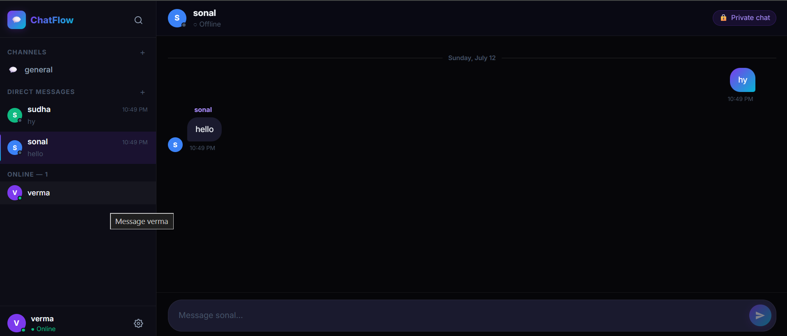
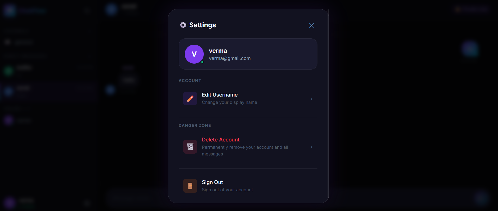

# 💬 ChatFlow – Real-Time Chat Application

A full-stack real-time chat application built with **React.js**, **Node.js**, **Express.js**, **MongoDB**, and **Socket.IO**.

---

## 🚀 Features

- 🔐 **JWT Authentication** – Register / Login with secure tokens
- 💬 **Multiple Chat Rooms** – Public channels with message history
- ⚡ **Real-Time Messaging** – Instant delivery via Socket.IO
- ✍️ **Typing Indicators** – See who's typing in real time
- 🟢 **Online/Offline Status** – Live user presence tracking
- 📜 **Message History** – Persisted in MongoDB, loaded on room join
- ➕ **Create Rooms** – Add new channels with emoji icons
- 🔍 **Search Users** – Find and block/unblock users
- ⚙️ **Settings Panel**:
  - Edit your username
  - Block / Unblock users
  - Delete account
- 🎨 **Premium Dark UI** – Glassmorphism, gradients, micro-animations

---


## 📸 Screenshots

### 🏠 Home Page


### 💬 Chat Page


### 👤 Profile Page


## 🗂️ Project Structure

```
chatbot/
├── server/             # Node.js + Express backend
│   ├── models/         # Mongoose models
│   ├── routes/         # REST API routes
│   ├── middleware/     # JWT auth middleware
│   ├── socket/         # Socket.IO handlers
│   └── server.js
└── client/             # React + Vite frontend
    └── src/
        ├── components/ # UI components
        ├── context/    # Auth & Socket contexts
        ├── hooks/      # Custom hooks
        ├── pages/      # Route pages
        └── services/   # Axios API service
```

---

## 🛠️ Setup & Run

### Prerequisites
- Node.js ≥ 18
- MongoDB running locally (default: `mongodb://localhost:27017`)

### 1. Install & start the backend

```bash
cd server
npm install
npm run dev
```

Server runs on **http://localhost:5000**

### 2. Install & start the frontend

```bash
cd client
npm install
npm run dev
```

Client runs on **http://localhost:5173**

---

## 🌐 API Endpoints

| Method | Route | Description |
|--------|-------|-------------|
| POST | `/api/auth/register` | Register user |
| POST | `/api/auth/login` | Login user |
| GET | `/api/auth/me` | Get current user |
| GET | `/api/rooms` | List all rooms |
| POST | `/api/rooms` | Create room |
| GET | `/api/rooms/:id/messages` | Get messages |
| GET | `/api/users/search?q=` | Search users |
| PUT | `/api/users/profile` | Update username |
| POST | `/api/users/block/:userId` | Block/unblock user |
| DELETE | `/api/users/account` | Delete account |

---

## 🔌 Socket.IO Events

| Event | Direction | Description |
|-------|-----------|-------------|
| `join-room` | Client → Server | Join a room |
| `leave-room` | Client → Server | Leave a room |
| `send-message` | Client → Server | Send a message |
| `typing` | Client → Server | Start typing |
| `stop-typing` | Client → Server | Stop typing |
| `new-message` | Server → Client | Receive a message |
| `user-typing` | Server → Client | Someone is typing |
| `user-stop-typing` | Server → Client | Typing stopped |
| `online-users-list` | Server → Client | Initial online list |
| `user-status-change` | Server → Client | User went online/offline |
